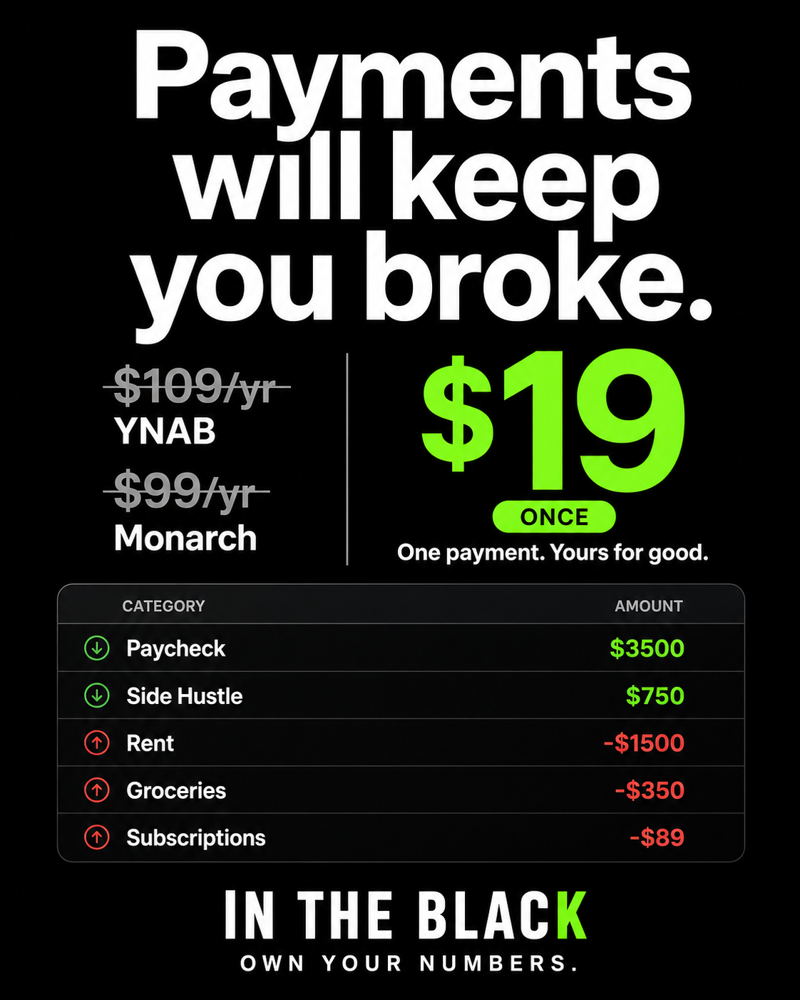

# Hook #01 — "Payments will keep you broke." 
### The Subscription Slayer — Your first campaign, ready to launch

> **Psychology:** Contrarian Rule + Loss Aversion + Anchoring
> This was the #1 comment-driver on FinTok in 2026 (26K likes, 823K views for the same opener). It works because it calls the *category* the problem, not the user. People who secretly feel dumb for paying to budget feel *seen*, not shamed — and they argue in the comments, which the algorithm loves.

---

### 📦 WHAT YOU HAVE READY

**Images generated (in `images/ads/`):**
- `hook-01-feed-final.png` — **4:5 feed** (1080x1350) — **USE THIS** for Meta Feed/Reels, TikTok, LinkedIn. Clean, no overlap, correct "IN THE BLACK" branding.
- `hook-01-story.png` — **9:16 story** (1080x1920) — Same design, taller — for Instagram Stories, TikTok Stories, YouTube Shorts thumbnails
- `hook-01-contrarian-v2.png` — Alternate version with more detailed spreadsheet (keep for A/B test)
- `hook-01-contrarian-feed.png` — First draft (has wrong logo — **do not use**, kept for reference)

**Best performer to launch first:** `hook-01-feed-final.png` (black, $19 ONCE in neon green). It's the most readable at thumb-size.

Preview:


---

### 📝 COPY-PASTE FOR META ADS MANAGER

**Campaign:** Sales / Conversions → Advantage+ (Broad)
**Placement:** Feed + Reels (4:5 will letterbox correctly on 1:1 too)

**Primary Text (Option A — Contrarian, recommended):**
```
Payments will keep you broke.

YNAB is $109/yr. Monarch is $99/yr. Rocket Money is $84/yr.

This is $19. Once.

It lives in a spreadsheet you already own. No app to learn. No bank login. Just green when money's in, red when it's out, and a dashboard that tells you what to fix first.

Works in Excel and Google Sheets. One payment. Yours for good.
```

**Primary Text (Option B — shorter, for Reels):**
```
Payments will keep you broke.

$109/yr to answer "am I okay?" is insane.
This $19 spreadsheet does it in green and red.
No subscription. No login. Own it forever.
```

**Headline:** Own Your Budget for $19
**Description (under headline):** One payment. Yours for good.
**CTA Button:** Shop Now or Get Offer

**Headline variation to A/B test:** "Cancel the $109/yr App. Keep the $19 Sheet."

---

### 🎬 VIDEO SCRIPT — 12-SECOND UGC (Use with same hook)

If you want video (recommended — video gets 1.5x the CTR of static in finance), film this on your phone:

**0-3s — HOOK (face to camera, no intro, bold on-screen text: "Payments will keep you broke.")**
> "Payments will keep you broke. I'm serious."

**3-8s — DEMO (screen record — type live)**
> "YNAB is $109 a year. This is $19 once. Watch — I type 'Expense' next to rent — whole row goes red. 'Income' next to paycheck — green. That's it."

[SFX: soft pop on color change. Show real spreadsheet from your product]

**8-12s — PAYOFF + CTA (back to face)**
> "No app. No bank login. It's just yours. Link's in bio."

**On-screen end card:** `$19 ONCE — IN THE BLACK — Own your numbers.`

**Caption:** Payments will keep you broke. I wasted $340 on apps before I made this $19 sheet do it all. #budgeting #ynabalternative #personalfinance #budgetspreadsheet

---

### 🎯 TARGETING — WHO TO SHOW IT TO FIRST

**Cold test (first $50):**
- Location: US (or US+CA)
- Age: 24-44
- Interests: YNAB, Monarch Money, Rocket Money, EveryDollar, Goodbudget, "Budgeting", Dave Ramsey, Personal finance, Excel, Google Sheets
- Exclude: Already purchased (once you have pixel)
- Budget: $20/day, 3 ads (this hook is Ad 1), Advantage+ audience ON

**Why this targeting:** You're intercepting people actively comparing budgeting apps — they're Googling "YNAB alternative" and seeing your ad instead. The price comparison in the image does the qualifying for you.

**Lookalike later:** After 50 purchases, create 1% Lookalike of purchasers.

---

### 🔗 LINK + TRACKING

1.  When your Stripe Payment Link is ready, set it in `content.json` → `stripePaymentLink`.
2.  Use this URL for the ad with UTMs:
```
https://intheblackbudget.com/?utm_source=meta&utm_medium=paid&utm_campaign=hook01_payments_broke&utm_content=feed-final
```
3.  Add the same `?utm_...` to the Stripe Payment Link's `?client_reference_id=` or just watch sales spike in Stripe Dashboard → Payments → filtered by date.

**Tip:** In Meta, set "Website URL" to your site *with UTMs*, not directly to Stripe. You want them to land on your pricing section first (trust), then click to Stripe. Direct-to-Stripe gets lower conversion for cold traffic.

---

### 🧪 HOW TO KNOW IT'S WINNING

- **Day 1-2:** Look at **Thumb-stop rate** (3-sec views / impressions). Good is >25% on Reels.
- **Day 3:** **CTR (link)** >0.85% on Meta Feed = beating finance benchmark (0.85% avg). Kill if <0.50% after $15 spend per ad.
- **CPA target:** For $19 product, aim for **$8-12 CPA** cold. If $15-18, your landing page needs work (not the hook). If >$25, pause.
- **Winner moves to 70% of budget on Day 5**, test Hook #02 with remaining 20%.

---

### ⚠️ LEGAL / COMPLIANCE NOTES

- Prices cited ($109/yr YNAB, $99/yr Monarch) are accurate as of June 2026 public pricing. Keep screenshot of their pricing page dated, or add tiny disclaimer: "*Competitor pricing as of June 2026, subject to change."
- Don't say "YNAB will keep you broke" — say "Payments will keep you broke" (category, not brand attack). Safer for ad approval.

---

### ✅ NEXT STEPS — Say the word and I will:

1. Replace all "BudgetSheet" logos correctly (already done in final)
2. Create a white-background variant for A/B test (black vs white — often +15% CTR to test both)
3. Build the landing-page section that matches this ad word-for-word (message match = +30% conversion) — I have the `index.html` ready, just need to anchor ad → #pricing
4. Generate Hook #02 ("$545 vs $19" anchor) when you're ready

Want the **white variant** or should I commit this pack and move to Hook #02?
